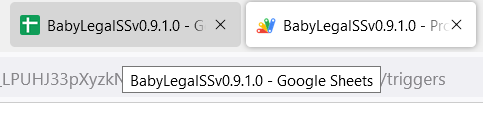
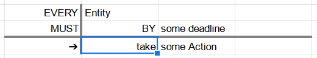
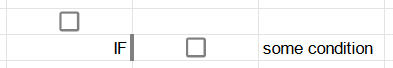
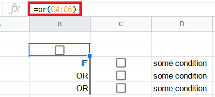
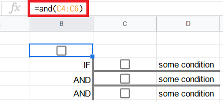
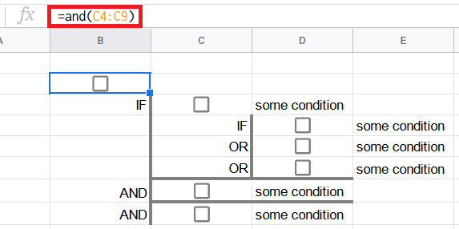

# How to Use the Legal Spreadsheet?

*Version: BabyLegalSSv0.9.1.0 -- 11 Mar 2022*

Legal Spreadsheet Logo IMAGE

**Company Name**

## Content

- [About the Legal Spreadsheet](#about)
- [Setup](#Setup)
  - [Signup](#Signup)
  - [Signin and Access](#signin)
  - [Settings](#Settings)
- [Keywords](#Keywords)
  - [Single Cell Keywords](#single-cell-keywords)
  - [Keyword Cell Sequences](#keyword-cell-sequences)
- [Appendix A - Glossary](#glossary)
- [Appendix B - Trademarks](#trademarks)

## About the Legal Spreadsheet<a name="about" />

The Legal Spreadsheet helps users to automate their legal writing.

## Setup

Users must have these setups to access the Legal Spreadsheet and use its keyword functions.

### Signup

Users must first [sign up](https://support.google.com/accounts/answer/27441?hl=en) for a Google:tm: Account.

### Signin and Access<a name="signin" />

<ol>
  <li>Users must <a href="https://myaccount.google.com">sign in</a> to their Google:tm: Account.</li>
  <li><a href="https://support.google.com/drive/answer/2423485?hl=en">Access Google:tm: Drive.</a></li>
  <li>Access the Legal Spreadsheet in the Google:tm: Drive.</li>
</ol>

### Settings

These settings are done in the Legal Spreadsheet Google Sheet to enable the keyword functions.

<ol>
  <li>Click on "Extensions" in the header and select "Apps Script".</li>
  
  <li>Select "Triggers" and select "Add Trigger".</li>
  
  <li>Select "onChange" for "Choose which function to run".</li>
  <li>Select "On change" for "Select event type".</li>
  <li>Click the "Save" button.</li>
  
  <li>Select back to the Legal Spreadsheet "BabyLegalSS".</li>
  
</ol>

## Keywords

### Single Cell Keywords<a name="single-cell-keywords" />

The typed keywords here are outlined in blue in the automatically generated layouts.

| **Type the Keyword** | **Google Sheet Will Output This Layout** |
| --- | --- |
| AND |  |
| OR |  |
| EVERY |  |
| IF |  |
| WHEN |  |
| MEANS[1](#footnote1) |  |
| IS[1](#footnote1) |  |
| IT IS[1](#footnote1) |  |

<a name="footnote1">1</a>: MEANS, IS and IT IS starts a constitutive rule.

### Keyword Cell Sequences<a name="keyword-cell-sequences" />

These are the ways the keyword sequences can be typed out.  Each keyword must be typed in each cell from top to bottom as shown below.  Each output layout will then appear as shown when each keyword is typed.  There is a waiting time of 3-5 seconds for each keyword's output to show completely.

| **Type these keywords** | **Possible layouts of these keywords** |
| --- | --- |
| IF, OR, OR[2](#footnote2) |  |
| IF, AND, AND[2](#footnote2) |  |
| IF, IF, OR, AND[2](#footnote2) |  |
| IF, IF, OR, OR, AND, AND[2](#footnote2) |  |

<a name="footnote2">2</a>: The logic formula is at the top left outlined in red.  The cell outlined in blue is the cell where the logic formula resides in.

## Appendix A - Glossary<a name="glossary" />

| **Term** | **Explanation** |
| --- | --- |
| Constitutive rules | Rules that make possible new forms of behaviour. |

## Appendix B - Trademarks<a name="trademarks" />

Google:tm: is a registered trademark of Google Inc.
